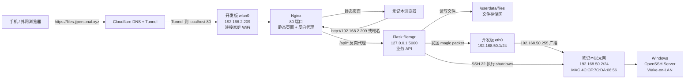
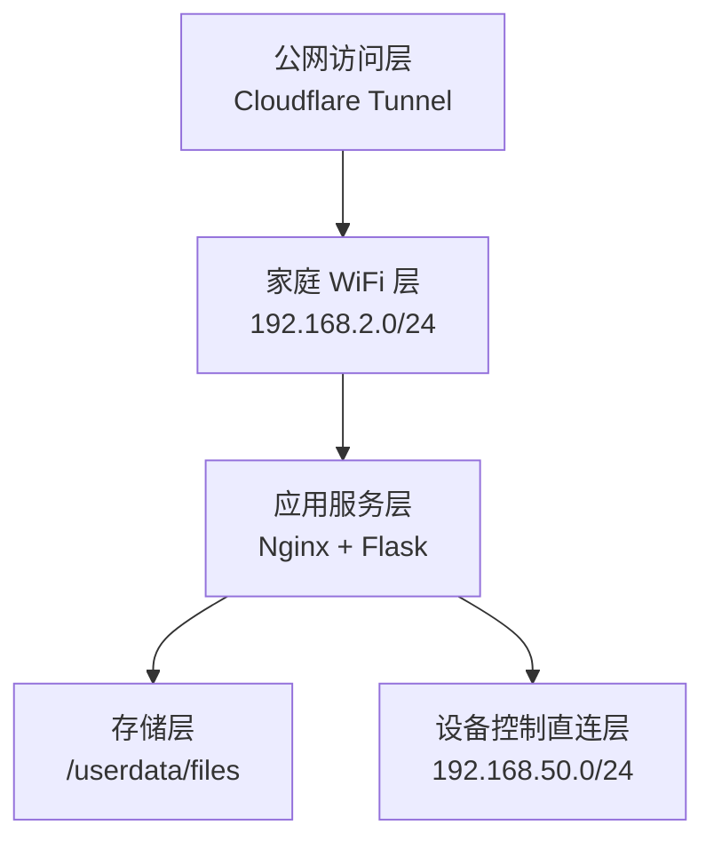

# 系统框图

## 总体架构

## 网络分层

## 关键设计

- 公网访问不做路由器端口转发，而是用 Cloudflare Tunnel。
- 文件系统不直接暴露给 Nginx 目录浏览，而是通过 Flask API 控制权限。
- 开发板 WiFi 和有线网口分工明确：WiFi 对外，有线对笔记本。
- Wake-on-LAN 不依赖家庭路由器广播，而是开发板通过直连网线向 `192.168.50.255` 广播。

