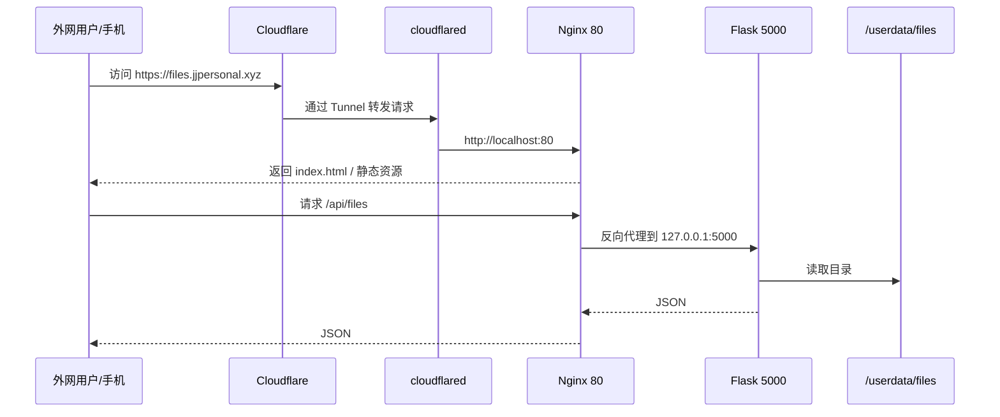
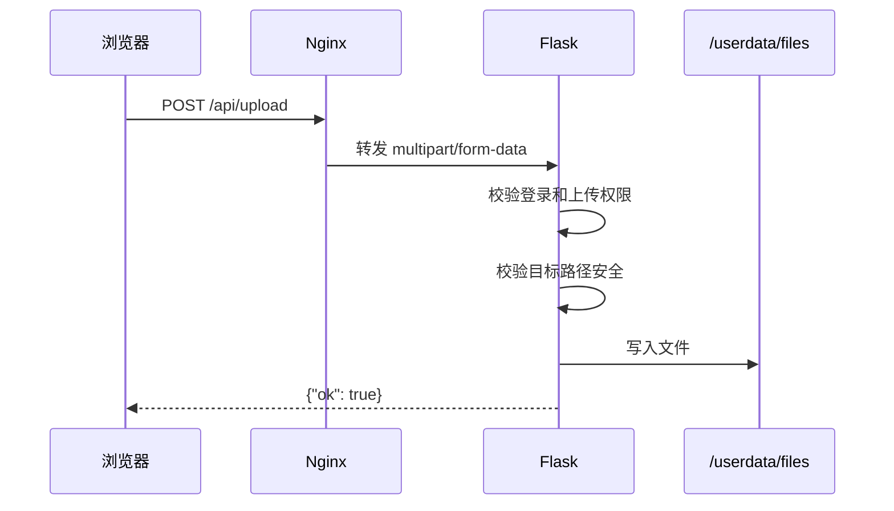
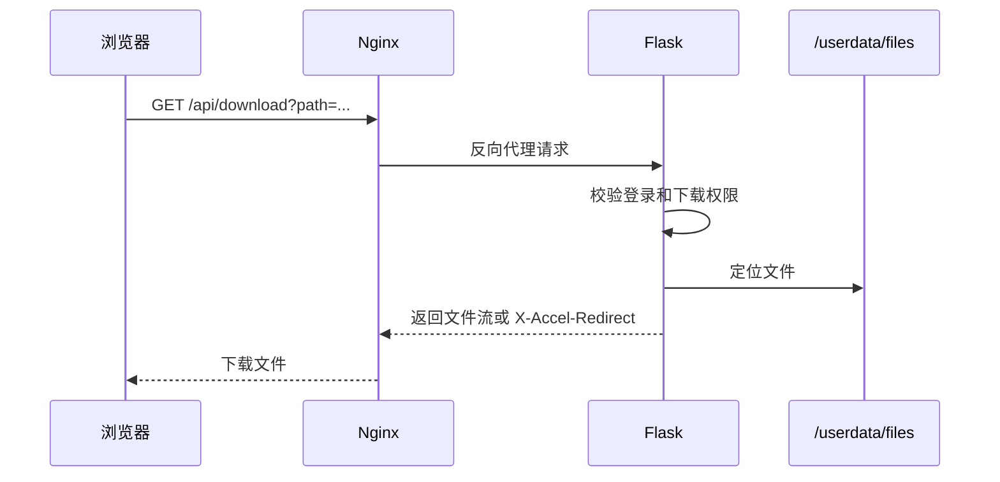
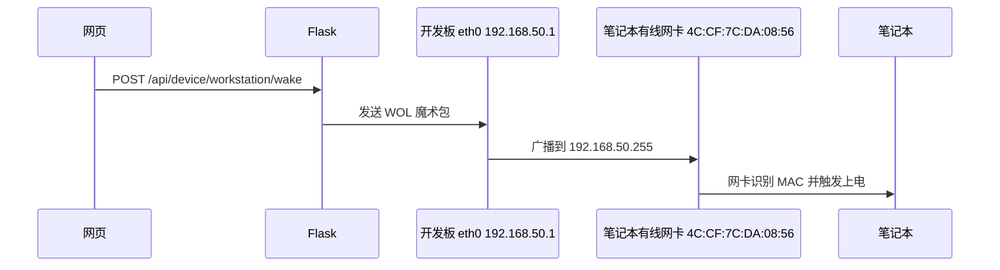
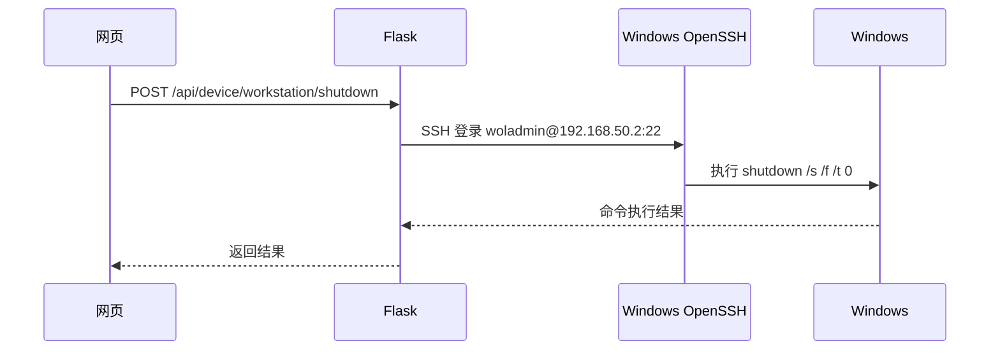

# 通信关系

## 公网访问链路

## 文件上传链路

## 文件下载链路

## 笔记本开机链路

## 笔记本关机链路

## 当前网络关系

| 网络 | 设备 | 地址 | 用途 |
|---|---|---|---|
| 家庭 WiFi | 开发板 wlan0 | `192.168.2.209/24` | Web、公网隧道 |
| 家庭 WiFi | 笔记本 WLAN | `192.168.2.92/24` | 普通上网 |
| 直连有线 | 开发板 eth0 | `192.168.50.1/24` | WOL/SSH 控制 |
| 直连有线 | 笔记本以太网 | `192.168.50.2/24` | 被控制端 |

## 关键判断

- 文件管理走 `Nginx -> Flask -> /userdata/files`。
- 公网访问走 `Cloudflare -> cloudflared -> Nginx`。
- 笔记本控制不走 WiFi，而走开发板和笔记本之间的有线直连网络。
- 网页显示 SSH 离线时，通常代表 `192.168.50.2:22` 不通。
- 笔记本关机后 SSH 离线是正常现象，但 WOL 仍然可以通过广播唤醒。

