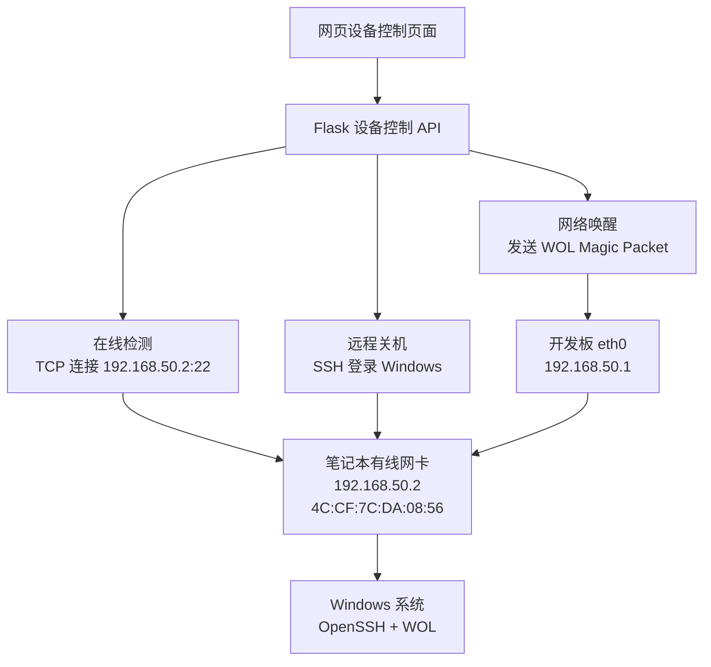

# 控制架构

## 控制目标

通过开发板网页控制笔记本电脑：

- 检测是否在线。
- 远程关机。
- 网络唤醒。

## 控制链路



## 开机控制

开机依赖 Wake-on-LAN。

### 触发条件

笔记本侧需要满足：

- BIOS 开启 Wake on LAN。
- Windows 关闭快速启动。
- 有线网卡开启 `Wake on Magic Packet`。
- 有线网卡开启 `S5 Wake on LAN` 或类似选项。
- 关机后网口灯仍亮。
- 开发板发送到正确 MAC 和正确广播地址。

### 当前有效参数

```text
目标 MAC：4C:CF:7C:DA:08:56
广播地址：192.168.50.255
开发板 eth0：192.168.50.1/24
笔记本以太网：192.168.50.2/24
```

### 手动测试命令

```bash
wakeonlan -i 192.168.50.255 4C:CF:7C:DA:08:56
```

## 关机控制

关机依赖 Windows OpenSSH。

### Windows 侧要求

- 安装 OpenSSH Server。
- `sshd` 服务启动并设置为自动启动。
- 防火墙允许 TCP 22。
- 用于关机的用户具有关机权限。

### 当前参数

```text
SSH 主机：192.168.50.2
SSH 用户：woladmin
SSH 密码：不写入仓库，实际在服务器网页“设备控制 -> SSH 密码”中配置
SSH 端口：22
关机命令：shutdown /s /f /t 0
```

账号说明：

| 项目 | 内容 |
|---|---|
| Windows 控制账号 | `woladmin` |
| 用途 | 供开发板通过 SSH 控制笔记本执行关机，后续也可执行打开应用、运行脚本等命令 |
| 密码保存位置 | 服务器网页“设备控制”中的 SSH 密码字段 |
| 后端保存文件 | `/userdata/server/apps/filemgr/devices.json` |
| 笔记策略 | 不在 Obsidian 明文记录密码，避免同步到所有设备后泄露 |

如需修改密码，应同时更新两处：

1. Windows 本地用户 `woladmin` 的密码。
2. 服务器网页“设备控制”里的 SSH 密码字段。

### 手动测试命令

开发板执行：

```bash
ssh -o ConnectTimeout=5 woladmin@192.168.50.2
```

如果能登录，说明远程关机链路基本正常。

## 在线检测

在线检测不是用 ICMP ping，而是检测 `192.168.50.2:22` 是否可连接。

原因：

- Windows 防火墙可能禁止 ping。
- 关机控制真正依赖的是 SSH 22 端口。
- 用 TCP 22 判断更贴近实际控制能力。

判断逻辑：

| 状态 | 含义 |
|---|---|
| SSH 在线 | 笔记本开机，OpenSSH 可达 |
| SSH 离线 | 笔记本关机、睡眠、网线断开、SSH 服务未启动或防火墙拦截 |

## eth0 开机自动配置

开发板重启后，`eth0` 可能不会自动保留 `192.168.50.1/24`，所以使用 systemd 服务固定配置。

服务文件：

```text
/etc/systemd/system/eth0-direct.service
```

服务职责：

- 启动 eth0。
- 清空 eth0 旧 IP。
- 添加 `192.168.50.1/24`。
- 让直连控制网络在每次开机后自动恢复。
