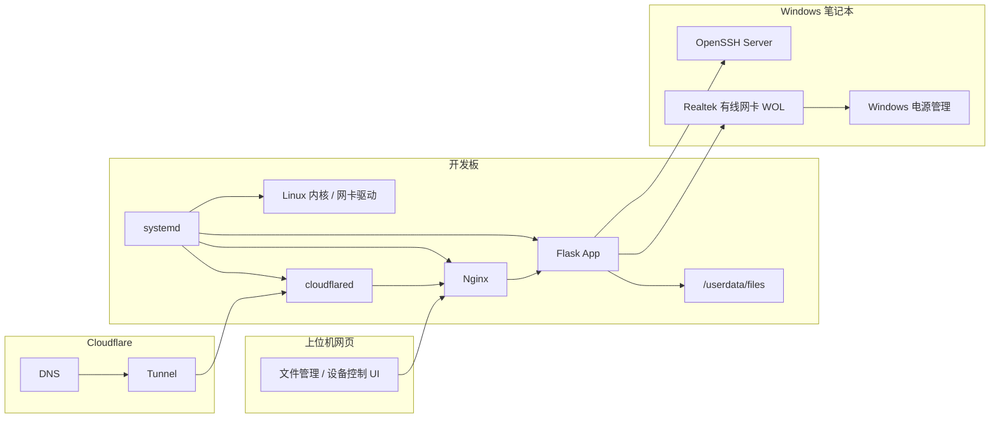

# 软件 / 固件 / 上位机关系

## 角色划分

| 角色 | 实体 | 职责 |
|---|---|---|
| 固件/底层系统 | 开发板 Linux、内核、网卡驱动 | 提供网络、文件系统、systemd 服务 |
| 服务端软件 | Nginx、Flask、cloudflared | 提供 Web、API、公网隧道 |
| 上位机网页 | 浏览器中的 Web UI | 用户操作入口 |
| 被控上位机 | Windows 笔记本 | 被远程关机和唤醒 |
| 第三方云服务 | Cloudflare | 公网域名和隧道入口 |

## 关系图



## 软件层

### Nginx

位置：开发板。

职责：

- 提供网页入口。
- 承载前端静态文件。
- 把 `/api/` 请求代理给 Flask。
- 对下载流量可做加速。

### Flask

位置：开发板。

职责：

- 处理业务逻辑。
- 管理登录和权限。
- 操作文件系统。
- 控制笔记本开关机。

### cloudflared

位置：开发板。

职责：

- 常驻后台连接 Cloudflare。
- 把 `files.jjpersonal.xyz` 的访问转发到开发板本地 Nginx。

## 固件/底层层

### Linux 系统

当前系统基于 Ubuntu focal。

负责：

- 文件系统挂载。
- systemd 服务管理。
- 网络接口管理。
- SSH、Nginx、Python 运行环境。

### eth0

用于开发板和笔记本直连。

固定配置：

```text
开发板 eth0：192.168.50.1/24
笔记本以太网：192.168.50.2/24
```

### wlan0

用于家庭 WiFi 和公网隧道。

典型地址：

```text
开发板 wlan0：192.168.2.209/24
默认网关：192.168.2.1
```

## 上位机层

### 浏览器网页

网页既可以从局域网访问，也可以从公网域名访问。

常用入口：

```text
http://192.168.2.209
https://files.jjpersonal.xyz
```

### Windows 笔记本

既是普通访问客户端，也是被控制设备。

被控能力：

- 通过 SSH 接收关机命令。
- 通过有线网卡接收 WOL 魔术包。

## 设计原则

- 用户只接触网页，不直接操作 Linux 命令。
- Nginx 处理入口和传输，Flask 处理权限和业务。
- 文件实际存储在 `/userdata`，避免占满根分区。
- 控制笔记本时优先使用有线直连，避免 WiFi 关机后不可控。

