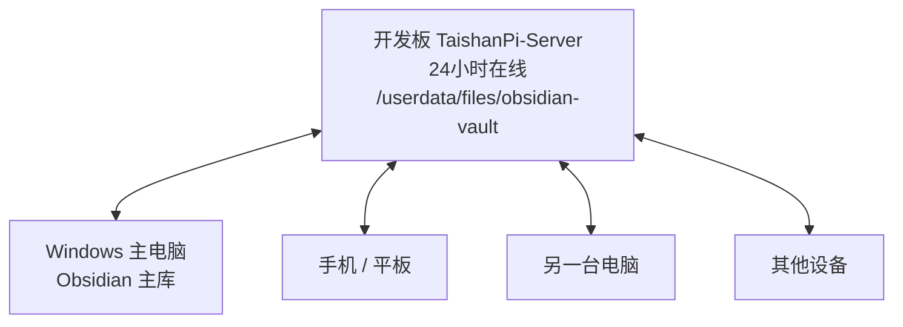
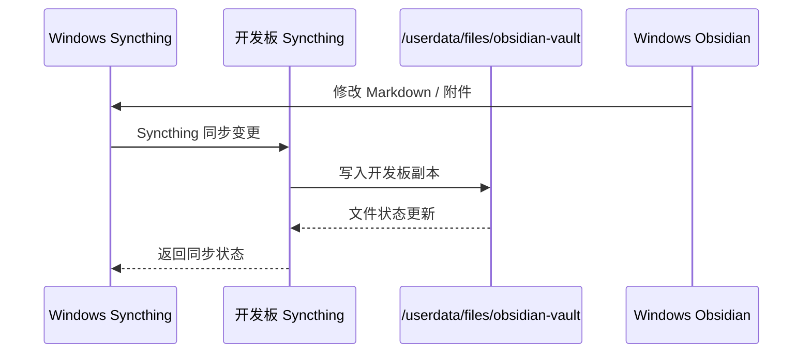
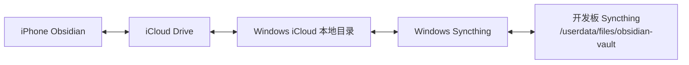
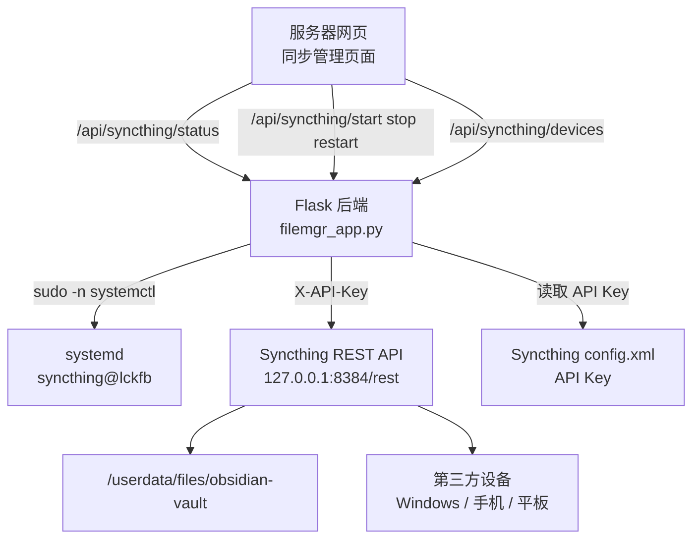

# Obsidian 同步站

## 目标

把开发板作为 24 小时在线的 Obsidian 同步中心，实现：

- Windows 主电脑和开发板自动双向同步 Obsidian 仓库。
- 开发板保留一份完整笔记库备份。
- 后续可以接入第三方电脑、手机、平板。
- 苹果手机可以通过 iCloud + Windows + Syncthing 的方式间接接入。

## 当前同步路径

| 设备 | 路径 | 说明 |
|---|---|---|
| Windows 主电脑 | `C:\Users\20634\Desktop\my notion\my notion` | 当前 Obsidian 主库 |
| 开发板 | `/userdata/files/obsidian-vault` | 开发板同步副本 |
| Syncthing 文件夹 ID | `obsidian-vault` | 多设备共享时必须保持一致 |

## 推荐拓扑

开发板应作为中心节点，因为它 24 小时在线。



注意：Syncthing 本质是点对点同步，不是真正的服务器-客户端模型。但实际使用中，开发板可以承担“中心节点”的角色。

## 通信关系



## 开发板安装 Syncthing

开发板执行：

```bash
sudo mkdir -p /etc/apt/keyrings
sudo curl -L -o /etc/apt/keyrings/syncthing-archive-keyring.gpg https://syncthing.net/release-key.gpg
echo "deb [signed-by=/etc/apt/keyrings/syncthing-archive-keyring.gpg] https://apt.syncthing.net/ syncthing stable" | sudo tee /etc/apt/sources.list.d/syncthing.list
sudo apt update
sudo apt install -y syncthing
```

启用 `lckfb` 用户服务：

```bash
sudo systemctl enable syncthing@lckfb
sudo systemctl start syncthing@lckfb
sudo systemctl status syncthing@lckfb --no-pager
```

## 让电脑访问开发板 Syncthing 管理页

默认 Syncthing 只监听 `127.0.0.1:8384`，电脑无法直接打开。需要把开发板 Syncthing GUI 地址改成 `0.0.0.0:8384`。

查找配置文件：

```bash
find /home/lckfb -name config.xml
```

通常路径：

```text
/home/lckfb/.local/state/syncthing/config.xml
```

修改监听地址：

```bash
sudo systemctl stop syncthing@lckfb
sed -i 's|<address>127.0.0.1:8384</address>|<address>0.0.0.0:8384</address>|' /home/lckfb/.local/state/syncthing/config.xml
sudo systemctl start syncthing@lckfb
```

检查端口：

```bash
ss -ltnp | grep 8384
```

电脑浏览器打开：

```text
http://192.168.50.1:8384
```

如果能打开，说明开发板 Syncthing 管理页已可访问。

## Windows 安装 Syncthing

从官网下载 Windows 版本：

```text
https://syncthing.net/downloads/
```

安装时配置项保持默认即可：

| 配置 | 默认值 | 是否修改 |
|---|---|---|
| 自动更新间隔 | `12` 小时 | 保持默认 |
| GUI 监听地址 | `127.0.0.1` | Windows 本机保持默认 |
| GUI 端口 | `8384` | 保持默认 |
| Relays enabled | `true` | 保持默认 |

安装后浏览器打开：

```text
http://127.0.0.1:8384
```

如果点击应用图标没有反应，属于正常情况。Syncthing 通常在后台运行，用浏览器管理。

## 设置 GUI 密码

开发板和 Windows 都建议设置 GUI 登录密码。

路径：

```text
右上角 操作 -> 设置 -> 图形用户界面
```

建议设置：

```text
GUI 用户名：admin 或 syncthing
GUI 密码：强密码
```

保存后重新登录。

## 两端互相添加设备

### 获取 Windows 设备 ID

Windows Syncthing 页面：

```text
操作 -> 显示 ID
```

复制 Windows 设备 ID。

### 开发板添加 Windows

开发板 Syncthing 页面：

```text
添加远程设备
```

填写：

```text
设备 ID：Windows 的设备 ID
设备名称：Windows-Obsidian
```

保存。

### 获取开发板设备 ID

开发板 Syncthing 页面：

```text
操作 -> 显示 ID
```

复制开发板设备 ID。

### Windows 添加开发板

Windows Syncthing 页面：

```text
添加远程设备
```

填写：

```text
设备 ID：开发板设备 ID
设备名称：TaishanPi-Server
```

保存。

## 建立 Obsidian 同步文件夹

建议从 Windows 端发起，因为 Windows 当前是主库。

Windows Syncthing 页面：

```text
添加文件夹
```

填写：

```text
文件夹标签：Obsidian Vault
文件夹 ID：obsidian-vault
文件夹路径：C:\Users\20634\Desktop\my notion\my notion
文件夹类型：发送与接收
```

在“共享”选项卡勾选：

```text
TaishanPi-Server
```

保存。

开发板页面会弹出共享邀请，点击添加。

开发板路径填写：

```text
/userdata/files/obsidian-vault
```

文件夹类型：

```text
发送与接收
```

保存后等待扫描和同步完成。

## 验证同步

### Windows 到开发板

在 Windows Obsidian 仓库新建：

```text
Syncthing同步测试.md
```

开发板检查：

```bash
ls -l "/userdata/files/obsidian-vault/Syncthing同步测试.md"
```

如果能看到文件，说明 Windows 到开发板同步成功。

### 开发板到 Windows

开发板执行：

```bash
echo "来自开发板的测试" > "/userdata/files/obsidian-vault/开发板同步测试.md"
```

然后检查 Windows Obsidian 仓库是否出现：

```text
开发板同步测试.md
```

如果出现，说明双向同步成功。

## 第三方设备接入

第三方设备只需要和开发板配对，不需要必须和 Windows 主电脑配对。

步骤：

1. 第三方设备安装 Syncthing。
2. 第三方设备复制自己的设备 ID。
3. 开发板 Syncthing 添加第三方设备 ID。
4. 第三方设备添加开发板设备 ID。
5. 开发板编辑 `obsidian-vault` 文件夹。
6. 在共享列表里勾选第三方设备。
7. 第三方设备接受共享。
8. 第三方设备本地路径选择自己的 Obsidian 仓库目录。

关键点：

```text
文件夹 ID 必须是 obsidian-vault
```

如果文件夹 ID 不一致，会变成另一个同步任务。

## iPhone 方案

iPhone 不能像 Android 一样稳定后台运行 Syncthing。可选方案有三种。

### 方案 1：Obsidian Sync

```text
iPhone Obsidian <-> Obsidian 官方同步
Windows / 开发板 <-> Syncthing
```

优点：

- 稳定。
- 省事。
- iOS 体验最好。

缺点：

- 付费。
- 不完全以开发板为中心。

### 方案 2：Mobius Sync

Mobius Sync 是 iOS 上的 Syncthing 客户端。

结构：

```text
iPhone Mobius Sync <-> 开发板 Syncthing <-> Windows Syncthing
```

优点：

- 更接近当前 Syncthing 架构。
- 可以继续以开发板为中心。

缺点：

- iOS 后台限制较多。
- 可能需要手动打开 App 才会同步。

### 方案 3：iCloud + Windows + Syncthing

这是当前推荐给 iPhone 的折中方案。



最终结构：

```text
iPhone Obsidian
      ⇅ iCloud Drive
Windows iCloud 本地目录
      ⇅ Syncthing
开发板 TaishanPi-Server
```

## iCloud + Windows + Syncthing 操作步骤

### 1. Windows 安装 iCloud

安装并登录 iCloud for Windows。

启用：

```text
iCloud Drive
```

### 2. 创建 iCloud Obsidian 目录

例如：

```text
C:\Users\20634\iCloudDrive\Obsidian\my notion
```

实际路径以 Windows iCloud 显示为准。

### 3. 迁移 Obsidian 主库

关闭 Obsidian。

把旧库：

```text
C:\Users\20634\Desktop\my notion\my notion
```

复制到：

```text
C:\Users\20634\iCloudDrive\Obsidian\my notion
```

### 4. Windows Obsidian 打开新库

在 Obsidian 中打开新路径：

```text
C:\Users\20634\iCloudDrive\Obsidian\my notion
```

### 5. 修改 Windows Syncthing 文件夹路径

Windows Syncthing 中编辑原来的：

```text
obsidian-vault
```

把路径从：

```text
C:\Users\20634\Desktop\my notion\my notion
```

改成：

```text
C:\Users\20634\iCloudDrive\Obsidian\my notion
```

开发板端路径不变：

```text
/userdata/files/obsidian-vault
```

### 6. iPhone Obsidian 打开 iCloud Vault

iPhone Obsidian 选择：

```text
iCloud Drive / Obsidian / my notion
```

这样 iPhone 通过 iCloud 同步到 Windows，Windows 再通过 Syncthing 同步到开发板。

## iCloud 方案注意事项

iCloud + Syncthing 是两套同步系统叠加，必须注意冲突。

风险：

- 同一篇笔记同时在 iPhone 和 Windows 编辑，可能产生冲突。
- iCloud 可能生成冲突副本。
- Syncthing 可能生成 `.sync-conflict` 文件。

推荐习惯：

- 尽量不要多端同时编辑同一篇笔记。
- 手机编辑完，等待 iCloud 同步完成。
- Windows 收到 iCloud 更新后，再让 Syncthing 同步到开发板。
- 发现冲突文件时，不要直接删除，先比较内容。

## iPhone 文件 App 连接服务器

iPhone 文件 App 的“连接服务器”通常是 SMB 协议。

如果开发板安装 Samba，可以通过：

```text
smb://192.168.50.1
smb://192.168.2.209
```

访问开发板文件。

适合：

- 浏览文件。
- 手动上传下载照片、PDF、文档。
- 临时查看服务器文件。

不适合：

- 作为 Obsidian iOS 的稳定自动同步方案。
- 直接暴露到公网。
- 替代 Syncthing 或 iCloud。

## 故障排查

| 现象 | 原因 | 处理 |
|---|---|---|
| `192.168.50.1:8384` 打不开 | Syncthing 未启动或只监听 127.0.0.1 | 查 `systemctl status syncthing@lckfb` 和 `ss -ltnp` |
| Windows 图标点击没反应 | Syncthing 是后台服务 | 打开 `http://127.0.0.1:8384` |
| 第一次同步很久 | 正在扫描大量文件 | 等待扫描完成 |
| 出现 `.sync-conflict` | 两端同时修改同一文件 | 手动比较后合并 |
| iPhone 不自动同步 | iOS 后台限制 | 使用 iCloud 或手动打开 Mobius Sync |
| 开发板空间变少 | Obsidian 附件过多 | 检查 `/userdata` 空间 |

## 当前建议

当前已成功完成：

- 开发板 Syncthing 可访问。
- Windows Syncthing 已安装。
- Windows 与开发板已配对。
- `obsidian-vault` 文件夹同步成功。
- 服务器网页已集成 Syncthing 服务控制和同步管理。

下一步可选：

- 把 Windows 主库迁移到 iCloud，实现 iPhone 接入。
- 接入第三方电脑。
- 在开发板设置定期备份 `/userdata/files/obsidian-vault`。

## 服务器网页集成 Syncthing 管理

### 目标

把 Syncthing 管理能力集成进自己的服务器网页，不必每次单独打开 Syncthing 后台。

网页端新增：

- `同步管理` 页面。
- 查看 Syncthing 是否运行。
- 查看 Syncthing 是否开机自启。
- 查看 Syncthing GUI 是否可访问。
- 一键打开 Syncthing 原生管理页。
- 启动、停止、重启 Syncthing。
- 查看 Syncthing systemd 日志。
- 查看 `obsidian-vault` 同步状态。
- 查看已连接设备在线/离线。
- 查看冲突文件。
- 添加新设备并自动共享 `obsidian-vault`。

### 控制架构



### 前端文件

开发板实际路径：

```text
/userdata/server/www/site/index.html
```

本地编辑路径：

```text
C:\Users\20634\Desktop\jjpresonal.html
```

新增页面：

```text
同步管理
```

新增交互：

- 刷新状态。
- 打开 Syncthing。
- 启动服务。
- 重启服务。
- 停止服务。
- 查看日志。
- 添加同步设备。

### 后端文件

开发板实际路径：

```text
/userdata/server/apps/filemgr/app.py
```

本地编辑路径：

```text
C:\Users\20634\Desktop\filemgr_app.py
```

新增常量：

```python
SYNCTHING_SERVICE = "syncthing@lckfb"
SYNCTHING_GUI_URL = "http://192.168.50.1:8384"
SYNCTHING_API_URL = "http://127.0.0.1:8384"
SYNCTHING_FOLDER_ID = "obsidian-vault"
SYNCTHING_FOLDER_PATH = Path("/userdata/files/obsidian-vault")
```

### 后端 API

| API | 方法 | 作用 |
|---|---|---|
| `/api/syncthing/status` | GET | 返回服务状态、文件夹状态、设备状态、冲突文件 |
| `/api/syncthing/start` | POST | 启动 Syncthing |
| `/api/syncthing/stop` | POST | 停止 Syncthing |
| `/api/syncthing/restart` | POST | 重启 Syncthing |
| `/api/syncthing/logs` | GET | 查看最近 80 行 Syncthing 日志 |
| `/api/syncthing/devices` | POST | 添加设备并共享 `obsidian-vault` |

### 权限设计

这些 API 使用已有权限：

```text
device_control
```

也就是说只有管理员或拥有设备控制权限的用户才能操作 Syncthing。

原因：

- 启停 Syncthing 会影响所有设备同步。
- 添加设备会把 Obsidian 仓库共享给新设备。
- 查看日志可能暴露路径和设备信息。

## sudo 授权

### 问题

网页后端执行：

```bash
systemctl restart syncthing@lckfb
```

可能报错：

```text
Interactive authentication required
```

原因是 Flask 后端运行用户没有 root 权限，不能直接控制 systemd 服务。

### 解决方式

给 `filemgr` 运行用户只授权控制 Syncthing。

先查看 `filemgr` 运行用户：

```bash
ps -o user= -p $(systemctl show -p MainPID --value filemgr)
```

如果输出是：

```text
lckfb
```

则添加 sudoers：

```bash
sudo tee /etc/sudoers.d/filemgr-syncthing >/dev/null <<'EOF'
lckfb ALL=(root) NOPASSWD: /bin/systemctl start syncthing@lckfb, /bin/systemctl stop syncthing@lckfb, /bin/systemctl restart syncthing@lckfb
lckfb ALL=(root) NOPASSWD: /usr/bin/systemctl start syncthing@lckfb, /usr/bin/systemctl stop syncthing@lckfb, /usr/bin/systemctl restart syncthing@lckfb
EOF
```

检查语法：

```bash
sudo visudo -cf /etc/sudoers.d/filemgr-syncthing
```

手动验证：

```bash
sudo -n systemctl restart syncthing@lckfb
systemctl status syncthing@lckfb --no-pager
```

### 后端调用方式

后端不要直接使用：

```bash
systemctl restart syncthing@lckfb
```

而是使用：

```bash
sudo -n systemctl restart syncthing@lckfb
```

`-n` 表示非交互模式。如果没有免密权限，命令会直接失败，不会卡住网页。

## Syncthing REST API

### API Key 来源

Syncthing 的 API Key 在配置文件中：

```text
/home/lckfb/.local/state/syncthing/config.xml
```

关键字段：

```xml
<apikey>...</apikey>
```

Flask 后端读取这个 key 后，通过请求头访问 Syncthing：

```text
X-API-Key: <apikey>
```

### 主要 REST API

| API | 作用 |
|---|---|
| `/rest/system/status` | 获取本机设备 ID 和系统状态 |
| `/rest/system/connections` | 获取远程设备连接状态 |
| `/rest/config` | 获取或修改 Syncthing 配置 |
| `/rest/db/status?folder=obsidian-vault` | 获取 Obsidian 文件夹同步状态 |

### 同步状态含义

常见状态：

| 状态 | 含义 |
|---|---|
| `idle` | 当前最新或空闲 |
| `syncing` | 正在同步 |
| `scanning` | 正在扫描文件 |
| `error` | 文件夹存在错误 |

网页显示：

- 已同步大小。
- 总大小。
- 待同步大小。
- 冲突文件列表。

## 添加同步设备

### 网页端能做什么

服务器网页可以：

- 把新设备 ID 加入开发板 Syncthing。
- 自动把 `obsidian-vault` 共享给新设备。

服务器网页不能做什么：

- 不能替新设备自动接受共享。
- 不能替新设备选择本地保存目录。

这是 Syncthing 的安全设计。

### 添加步骤

1. 新设备安装 Syncthing。
2. 新设备打开 Syncthing 管理页。
3. 新设备复制自己的设备 ID。
4. 服务器网页进入：

```text
同步管理
```

5. 在 `添加同步设备` 中填写：

```text
设备名称：例如 iPhone / MacBook / Office-PC
设备 ID：粘贴新设备的 Syncthing ID
```

6. 点击：

```text
添加并共享 Obsidian
```

7. 回到新设备 Syncthing。
8. 接受开发板设备。
9. 接受 `obsidian-vault` 文件夹共享。
10. 在新设备选择本地 Obsidian 仓库目录。

### 关键限制

文件夹 ID 必须保持：

```text
obsidian-vault
```

否则会变成另一个独立同步任务。

## 部署步骤

### 从 Windows 上传前后端

```powershell
scp "C:\Users\20634\Desktop\jjpresonal.html" lckfb@192.168.50.1:/userdata/server/www/site/index.html
scp "C:\Users\20634\Desktop\filemgr_app.py" lckfb@192.168.50.1:/userdata/server/apps/filemgr/app.py
```

### 开发板检查后端语法

```bash
python3 -m py_compile /userdata/server/apps/filemgr/app.py
```

### 重启 Flask 后端

```bash
sudo systemctl restart filemgr
sudo systemctl status filemgr --no-pager
```

### 打开网页验证

进入服务器网页：

```text
http://192.168.50.1
```

或公网域名：

```text
https://files.jjpersonal.xyz
```

登录管理员账号后进入：

```text
同步管理
```

## 故障排查

| 现象 | 原因 | 处理 |
|---|---|---|
| 页面显示 Syncthing 正在运行，但重启失败 | systemctl 需要 root 权限 | 配置 `/etc/sudoers.d/filemgr-syncthing` |
| 报 `Interactive authentication required` | 没有免密 sudo | 使用 `sudo -n systemctl` 并配置 sudoers |
| 状态能读，设备列表为空 | Syncthing API 未返回设备或没有远程设备 | 打开 Syncthing 原生页面确认 |
| 添加设备失败 | 设备 ID 格式错误 | 复制完整 Syncthing 设备 ID |
| 新设备没有同步 | 新设备没有接受共享 | 到新设备 Syncthing 接受 `obsidian-vault` |
| 冲突文件出现 | 多设备同时修改同一笔记 | 手动比较 `.sync-conflict` 文件 |
| API key not found | 找不到 Syncthing 配置文件 | 检查 `config.xml` 路径 |

## 当前集成结论

现在服务器网页已经不仅是文件管理系统，也具备了 Syncthing 同步站的基础控制台能力：

```text
服务器网页 -> Flask 后端 -> systemd 控制 Syncthing
服务器网页 -> Flask 后端 -> Syncthing REST API -> 同步状态 / 设备管理
```

开发板继续作为 Obsidian 同步中心节点。
