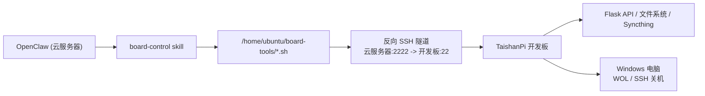

# 云服务器 OpenClaw 联动开发板

## 目标

把云服务器上的 OpenClaw 作为高算力控制中心，让它通过固定脚本控制开发板，再由开发板控制本地 Windows 电脑。

最终链路：



## 当前成果

- 开发板可以免密 SSH 到云服务器
- 云服务器可以通过反向 SSH 连回开发板
- 云服务器已经有固定动作脚本 `board-tools`
- OpenClaw 已经能识别 `board-control` skill
- OpenClaw 可以查看开发板状态
- 云服务器可以通过开发板：
  - 唤醒 Windows
  - 关闭 Windows
  - 上传文件到开发板
  - 从开发板取回文件
  - 查看 Syncthing 状态

## 云服务器信息

```text
系统用户：ubuntu
公网 IP：124.221.149.86
OpenClaw 运行用户：root
OpenClaw 命令路径：/root/.local/share/pnpm/openclaw
```

说明：

- OpenClaw 实际运行在 `root` 环境
- 所以 skill 应放到 `/root/.openclaw/workspace/skills/`
- 如果放在 `/home/ubuntu/.openclaw/`，OpenClaw 不一定会读取

## SSH 联通方式

### 1. 开发板 -> 云服务器

在开发板上执行：

```bash
ssh-copy-id ubuntu@124.221.149.86
```

成功标志：

```text
Number of key(s) added: 1
```

之后开发板可直接免密登录云服务器：

```bash
ssh ubuntu@124.221.149.86
```

### 2. 云服务器 -> 开发板（反向 SSH）

手工测试命令，在开发板执行：

```bash
ssh -N -R 2222:localhost:22 ubuntu@124.221.149.86
```

然后在云服务器执行：

```bash
ssh -p 2222 lckfb@localhost
```

如果成功进入开发板，说明反向隧道已打通。

### 3. 反向 SSH 开机自启

开发板上的 `systemd` 服务：

```ini
[Unit]
Description=Reverse SSH tunnel to cloud server
After=network-online.target
Wants=network-online.target

[Service]
User=lckfb
ExecStart=/usr/bin/ssh -o ServerAliveInterval=60 -o ServerAliveCountMax=3 -o ExitOnForwardFailure=yes -o StrictHostKeyChecking=accept-new -N -R 2222:localhost:22 ubuntu@124.221.149.86
Restart=always
RestartSec=10

[Install]
WantedBy=multi-user.target
```

启用方法：

```bash
sudo systemctl daemon-reload
sudo systemctl enable reverse-ssh-tunnel
sudo systemctl start reverse-ssh-tunnel
sudo systemctl status reverse-ssh-tunnel --no-pager
```

## 云服务器到开发板免密

先在云服务器生成密钥：

```bash
ssh-keygen -t ed25519
```

然后通过反向隧道复制公钥到开发板：

```bash
ssh-copy-id -p 2222 lckfb@localhost
```

成功后，云服务器可直接免密连接开发板：

```bash
ssh -p 2222 lckfb@localhost
```

## board-tools 目录结构

云服务器上的固定动作脚本目录：

```text
/home/ubuntu/board-tools/
```

建议结构：

```text
board-tools/
├─ _common.sh
├─ board-status.sh
├─ wake-pc.sh
├─ shutdown-pc.sh
├─ send-to-board.sh
├─ get-from-board.sh
├─ sync-status.sh
├─ service-status.sh
├─ service-restart.sh
├─ sync-restart.sh
├─ board-reboot.sh
└─ logs/
   └─ board-control.log
```

## 已验证脚本

### 查看开发板状态

```bash
/home/ubuntu/board-tools/board-status.sh
```

### 唤醒 Windows

```bash
/home/ubuntu/board-tools/wake-pc.sh
```

### 查看 Syncthing 状态

```bash
/home/ubuntu/board-tools/service-status.sh syncthing
```

### 上传文件到开发板

```bash
echo hello > ~/uploads/test.txt
/home/ubuntu/board-tools/send-to-board.sh ~/uploads/test.txt
```

### 从开发板取回文件

```bash
/home/ubuntu/board-tools/get-from-board.sh /userdata/files/test.txt ~/
```

## 危险动作授权

为保证 OpenClaw 不直接拿 root shell，只给开发板用户 `lckfb` 最小 sudo 白名单。

### 开发板重启授权

```bash
sudo tee /etc/sudoers.d/board-reboot >/dev/null <<'EOF'
lckfb ALL=(root) NOPASSWD: /sbin/reboot
lckfb ALL=(root) NOPASSWD: /usr/sbin/reboot
EOF
sudo visudo -cf /etc/sudoers.d/board-reboot
```

### 服务重启授权

```bash
sudo tee /etc/sudoers.d/board-services >/dev/null <<'EOF'
lckfb ALL=(root) NOPASSWD: /bin/systemctl restart filemgr, /bin/systemctl restart cloudflared, /bin/systemctl restart reverse-ssh-tunnel
lckfb ALL=(root) NOPASSWD: /usr/bin/systemctl restart filemgr, /usr/bin/systemctl restart cloudflared, /usr/bin/systemctl restart reverse-ssh-tunnel
lckfb ALL=(root) NOPASSWD: /bin/systemctl restart syncthing@lckfb, /usr/bin/systemctl restart syncthing@lckfb
EOF
sudo visudo -cf /etc/sudoers.d/board-services
```

## OpenClaw Skill 放置位置

错误位置：

```text
/home/ubuntu/.openclaw/workspace/skills/board-control/
```

正确位置：

```text
/root/.openclaw/workspace/skills/board-control/
```

因为 OpenClaw 进程运行用户是 `root`。

复制方式：

```bash
sudo mkdir -p /root/.openclaw/workspace/skills/board-control
sudo cp /home/ubuntu/.openclaw/workspace/skills/board-control/SKILL.md /root/.openclaw/workspace/skills/board-control/SKILL.md
```

辅助 prompt 也可放在：

```text
/root/.openclaw/workspace/prompts/
```

## `$HOME` 路径问题

一开始 skill 里使用了：

```text
~/board-tools/
```

但 OpenClaw 以 `root` 运行时，`$HOME=/root`，导致它去找：

```text
/root/board-tools/
```

而真实脚本目录在：

```text
/home/ubuntu/board-tools/
```

最终修法：

1. Skill 中全部改为绝对路径：

```text
/home/ubuntu/board-tools/*.sh
```

2. `_common.sh` 不再依赖 `$HOME`，而是按脚本自身目录定位：

```bash
SCRIPT_DIR="$(cd "$(dirname "${BASH_SOURCE[0]}")" && pwd)"
LOG_DIR="$SCRIPT_DIR/logs"
```

这样即使脚本从 root 环境调用，也能正常找到同目录的 `_common.sh`。

## board-control Skill 作用

当前 skill 负责约束 OpenClaw：

- 只允许调用固定 wrapper scripts
- 不允许自由拼接 `ssh / scp / curl / sudo`
- 只允许传输白名单目录文件
- 危险动作必须用户明确要求

已纳入的动作：

- `board-status`
- `sync-status`
- `service-status`
- `wake-pc`
- `shutdown-pc`
- `send-to-board`
- `get-from-board`
- `board-reboot`
- `sync-restart`
- `service-restart`

## 推荐的 OpenClaw 使用方式

在 OpenClaw 对话中直接说：

- `查看开发板状态`
- `查看同步状态`
- `唤醒电脑`
- `关闭电脑`
- `重启 syncthing`
- `重启开发板`
- `把 ~/uploads/test.txt 传到开发板`
- `把开发板上的 /userdata/files/test.txt 取回来`

## 当前建议

### 开发板适合做

- 文件服务器
- Syncthing 节点
- 本地控制面板
- Windows 控制代理
- Cloudflare 出口

### 云服务器适合做

- OpenClaw 主服务
- AI / Agent 执行中心
- 统一控制入口
- 将来对接更多自动化能力

## 后续可扩展方向

- `pc-open-obsidian`
- `pc-open-vscode`
- `pc-open-browser`
- `sync-note-vault`
- `restart-filemgr`
- `restart-cloudflared`
- `upload-folder-to-board`
- `board-disk-cleanup`

## 故障排查

### 1. 云服务器无法连回开发板

检查开发板反向隧道：

```bash
sudo systemctl status reverse-ssh-tunnel --no-pager
sudo journalctl -u reverse-ssh-tunnel -n 50 --no-pager
```

云服务器测试：

```bash
ssh -p 2222 lckfb@localhost
```

### 2. OpenClaw 找不到 skill

检查：

```bash
sudo ls -R /root/.openclaw/workspace/skills
```

确认 `board-control` 在 root 的 workspace 下。

### 3. OpenClaw 调脚本失败

检查：

```bash
ls -l /home/ubuntu/board-tools
sed -n '1,80p' /home/ubuntu/board-tools/_common.sh
```

### 4. 服务重启失败

检查 sudoers：

```bash
sudo visudo -cf /etc/sudoers.d/board-services
sudo visudo -cf /etc/sudoers.d/board-reboot
```

### 5. Windows 控制失败

开发板本地检查：

```bash
curl -s http://127.0.0.1/api/device/workstation/status
ssh -o ConnectTimeout=5 woladmin@192.168.50.2
```
