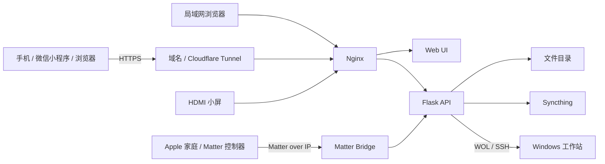

# TaishanPi RK3566 家庭服务器与工作站控制网关

[](https://github.com/dobichtrang15-cmyk/taishanpi-rk3566-server/actions/workflows/validate.yml)

这是一个运行在立创·泰山派 RK3566 Linux 开发板上的家庭服务器项目。它将文件管理、Syncthing、HDMI 本地面板、Windows 工作站开关机、微信小程序和 Matter 接入整合为一套可部署、可备份、可迁移的系统。

项目的核心原则是：开发板持续在线，Windows 工作站按需启动。开机使用 Wake-on-LAN，关机通过 Windows OpenSSH 执行系统命令，不需要继电器或修改电脑电源线。

## 当前能力

- Flask 文件管理与账号权限
- Nginx 静态站点和 API 反向代理
- 文件上传、下载、预览、目录管理
- Syncthing 状态和服务控制
- Windows 在线状态检测、WOL 开机、SSH 关机
- HDMI 小屏 kiosk 控制面板
- 微信小程序客户端
- Matter 插座设备，可接入 Apple“家庭”等 Matter 控制器
- Cloudflare Tunnel / 反向 SSH 的远程接入基础
- 一键安装、更新、备份和发布打包脚本

## 系统结构



Matter 负责本地智能家居接入；域名负责 HTTPS 远程访问。没有 HomePod 或 Apple TV 时，域名不能替代苹果家庭中枢，但可以通过网页、微信小程序或 iPhone 快捷指令远程调用开关机 API。

## 仓库目录

| 路径 | 职责 |
| --- | --- |
| `apps/filemgr/` | Flask 后端、认证、文件、设备和 Syncthing API |
| `apps/matter-workstation/` | Matter 工作站电源桥 |
| `www/site/` | Web 主控制台 |
| `www/kiosk.html` | HDMI 本地控制面板 |
| `miniapp/` | 微信小程序 |
| `qt/` | Qt 本地控制台原型 |
| `deploy/` | 安装、更新、备份、Nginx 和 systemd 配置 |
| `scripts/` | 本地辅助、验证和发布打包 |
| `docs/` | 项目背景、架构、迁移、维护和发布文档 |
| `00-10*.md` | 项目演进过程中的设计与运维记录 |

## 环境要求

推荐环境：

- ARM64 或 x86_64 Linux
- Ubuntu 20.04 及以上，或兼容 systemd 的 Debian 系发行版
- Python 3.8+
- Node.js 22.13+（启用 Matter 时）
- Nginx
- systemd
- 可选：X11 桌面和 Chromium/Firefox（启用 HDMI kiosk 时）

默认部署位置为 `/userdata/server`，文件目录为 `/userdata/files`。服务通过稳定软链接 `/opt/taishanpi-server` 和 `/srv/taishanpi-files` 访问，因此迁移到其他磁盘时无需修改 systemd 和 Nginx 文件。

## 快速部署

```bash
git clone https://github.com/dobichtrang15-cmyk/taishanpi-rk3566-server.git
cd taishanpi-rk3566-server
sudo bash ./deploy/install.sh
```

无桌面的服务器可关闭 kiosk：

```bash
sudo INSTALL_KIOSK=0 bash ./deploy/install.sh
```

不安装 Matter：

```bash
sudo INSTALL_MATTER=0 INSTALL_KIOSK=0 bash ./deploy/install.sh
```

使用其他数据盘：

```bash
sudo \
  TAISHANPI_INSTALL_ROOT=/mnt/data/taishanpi-server \
  TAISHANPI_FILES_ROOT=/mnt/data/files \
  INSTALL_KIOSK=0 \
  bash ./deploy/install.sh
```

定制系统的软件包状态异常、但依赖已经手工安装时：

```bash
sudo SKIP_APT=1 bash ./deploy/install.sh
```

`SKIP_APT=1` 不会跳过依赖检查；缺少 Python、Node.js 或浏览器时安装会明确失败。

## 首次登录

新部署且不存在 `users.json` 时，后端会生成随机管理员密码，保存到：

```text
/opt/taishanpi-server/apps/filemgr/bootstrap-admin.txt
```

查看凭据：

```bash
sudo cat /opt/taishanpi-server/apps/filemgr/bootstrap-admin.txt
```

首次登录后立即修改密码，并删除该文件：

```bash
sudo rm /opt/taishanpi-server/apps/filemgr/bootstrap-admin.txt
```

也可以在首次启动前通过 `/etc/default/filemgr` 设置 `FILEMGR_BOOTSTRAP_PASSWORD`。已有 `users.json` 时不会覆盖现有账号。

## 工作站控制

默认网络设计：

- 开发板 `eth0`：`192.168.50.1/24`
- Windows 有线网卡：`192.168.50.2/24`
- WOL 广播：`192.168.50.255`
- Windows SSH：TCP 22

实际 IP、MAC、SSH 用户和关机命令保存在板子本地的 `devices.json`，不会进入 Git。可在网页“设备控制”页面配置。

## Matter 配置

Matter 服务配置：

```text
/etc/default/matter-workstation
```

查看服务和配对码：

```bash
sudo systemctl status matter-workstation --no-pager -l
sudo journalctl -u matter-workstation -n 200 --no-pager -l
```

配对状态保存在 `/var/lib/matter-workstation`。正常升级和故障排查时不要删除该目录，否则 Apple“家庭”等控制器中的配对会失效。

## 配置入口

| 配置 | 默认位置 | 是否提交 Git |
| --- | --- | --- |
| 后端环境变量 | `/etc/default/filemgr` | 否，仓库仅有模板 |
| Matter 环境变量 | `/etc/default/matter-workstation` | 否，仓库仅有模板 |
| 直连网口配置 | `/etc/default/eth0-direct` | 否，仓库仅有模板 |
| 用户与密码哈希 | `apps/filemgr/users.json` | 否 |
| 设备 IP/MAC/SSH | `apps/filemgr/devices.json` | 否 |
| 登录令牌 | `apps/filemgr/tokens.json` | 否 |
| Matter Fabric 状态 | `/var/lib/matter-workstation` | 否，需单独备份 |

## 日常维护

更新：

```bash
cd /path/to/taishanpi-rk3566-server
sudo bash ./deploy/update.sh
```

检查服务：

```bash
sudo systemctl status nginx filemgr eth0-direct matter-workstation --no-pager
sudo journalctl -u filemgr -n 100 --no-pager
sudo journalctl -u matter-workstation -n 100 --no-pager -l
curl -fsS http://127.0.0.1:5000/api/device/workstation/status
```

备份私有配置：

```bash
sudo bash ./deploy/backup.sh
```

本地验证和打包：

```powershell
powershell -ExecutionPolicy Bypass -File .\scripts\validate-project.ps1
powershell -ExecutionPolicy Bypass -File .\scripts\package-project.ps1
```

## 文档

- [项目背景](docs/项目背景.md)
- [架构与数据流](docs/架构与数据流.md)
- [迁移指南](docs/迁移指南.md)
- [维护手册](docs/维护手册.md)
- [发布与打包](docs/发布与打包.md)
- [安全说明](SECURITY.md)
- [参与维护](CONTRIBUTING.md)
- [变更记录](CHANGELOG.md)

## 安全边界

不要把 Flask 5000 端口直接暴露到公网。公网入口应经过 HTTPS、Nginx 和额外访问控制。真实密码、Token、私钥、Cloudflare 凭据、Syncthing 配置和 Matter 运行态都不得提交。

仓库目前没有声明开源许可证。除非仓库所有者后续添加许可证，否则代码默认保留全部权利。
