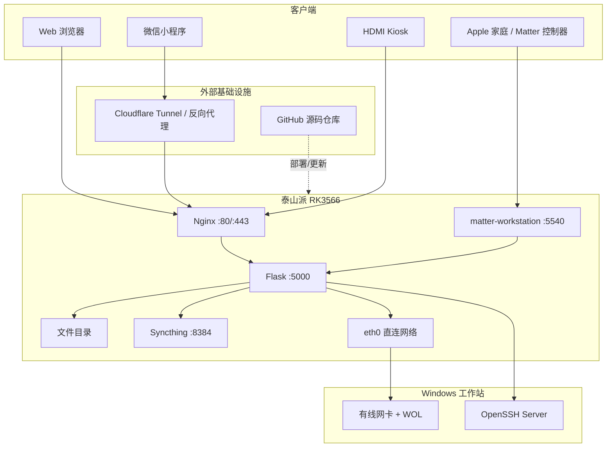
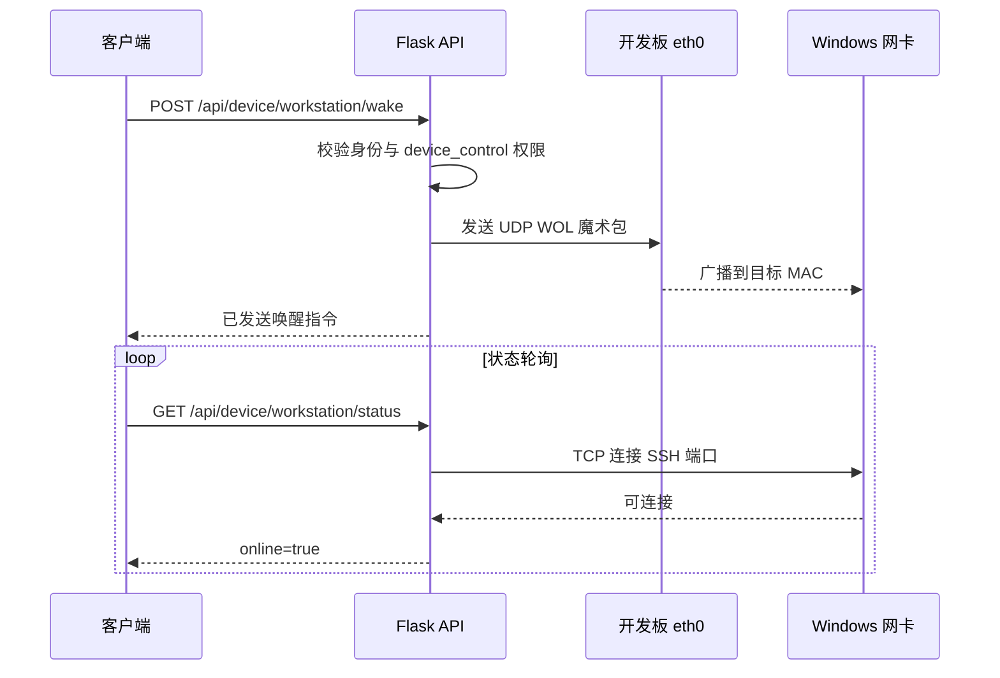
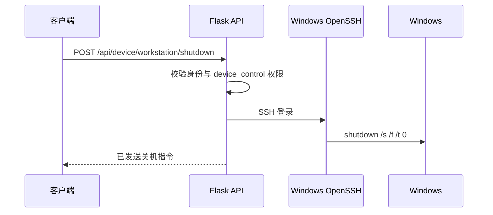
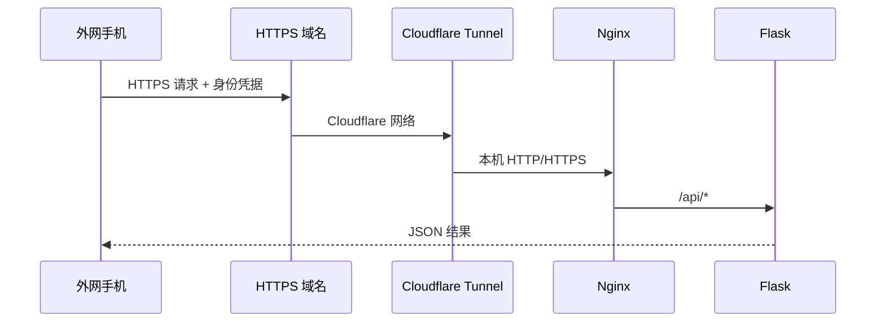

# 架构与数据流

## 1. 组件视图



## 2. 服务职责

### Nginx

- 提供 `www/site` 和 `kiosk.html`。
- 把 `/api/` 反向代理到 `127.0.0.1:5000`。
- 使用 internal alias 交付受保护的文件下载。
- 作为 HTTPS 隧道进入应用的唯一入口。

### Flask

- 管理账号、会话和 Bearer Token。
- 执行文件操作并限制在 `FILEMGR_ROOT` 内。
- 保存工作站控制配置。
- 检查工作站 SSH 端口。
- 发送 WOL 魔术包。
- 使用 SSH 执行 Windows 关机。
- 查询和控制 Syncthing。

### Matter Bridge

- 表现为 Matter On/Off 插座。
- 将 Matter 命令转换为本机 Flask API 请求。
- 定时读取工作站状态并同步 OnOff 属性。
- 将配对 Fabric 持久化到 `/var/lib/matter-workstation`。

### eth0-direct

- 启用选定的直连网卡。
- 使用 `/etc/default/eth0-direct` 中的地址配置网卡。
- 不承担默认路由，避免影响开发板 Wi-Fi 上网。

## 3. 开机数据流



Matter 开机走同一流程，只是第一个客户端变成 `matter-workstation`。

## 4. 关机数据流



## 5. Matter 网络路径

Matter over IP 同时依赖：

- mDNS：UDP 5353，用于发现 `_matter._tcp.local`。
- Matter 会话：默认 UDP 5540。
- IPv6 链路本地地址：常用于局域网 CASE 会话。
- 已保存的 Fabric：设备和控制器互相信任的身份数据。

iPhone 与开发板处于不同 VLAN、访客网络或 AP 隔离网络时，即使两边能访问互联网，也可能无法发现或连接 Matter 服务。

## 6. 远程域名路径



域名是应用层入口，不会改变 Apple“家庭”的 Matter 路由。远程 Siri 控制可以通过 iPhone 快捷指令请求 HTTPS API 实现。

## 7. 信任边界

| 边界 | 默认信任 | 必须保护 |
| --- | --- | --- |
| 浏览器到 Nginx | 不信任 | HTTPS、登录、Token、限流 |
| Nginx 到 Flask | 本机可信 | Flask 仅监听本机或受防火墙保护 |
| Matter 到 Flask | 本机可信 | API 只允许回环路径或服务身份 |
| Flask 到 Windows | 专用直连网络 | SSH 密钥/密码、Windows 防火墙 |
| GitHub 到开发板 | 只信任审核后的代码 | 固定分支、审查差异、备份后更新 |
| 运行态到 Git | 完全不信任 | `.gitignore`、发布检查、人工审计 |

## 8. 持久化数据

| 数据 | 位置 | 备份级别 |
| --- | --- | --- |
| 用户和密码哈希 | `apps/filemgr/users.json` | 必须 |
| 设备控制配置 | `apps/filemgr/devices.json` | 必须 |
| Flask Session 密钥 | `apps/filemgr/secret.key` | 建议 |
| Bearer Token | `apps/filemgr/tokens.json` | 可选，泄漏需撤销 |
| Matter Fabric | `/var/lib/matter-workstation` | 必须，丢失需重新配对 |
| 用户文件 | `FILEMGR_ROOT` | 必须，独立数据备份 |
| Syncthing 配置 | 用户配置目录 | 必须 |
| Cloudflare 凭据 | `/etc/cloudflared` 等 | 必须且加密保存 |

## 9. 稳定路径与实际路径

部署脚本创建：

```text
/opt/taishanpi-server -> TAISHANPI_INSTALL_ROOT
/srv/taishanpi-files  -> TAISHANPI_FILES_ROOT
```

systemd、Nginx 和应用默认只引用稳定路径。迁移磁盘时修改软链接或重新运行安装脚本即可。
